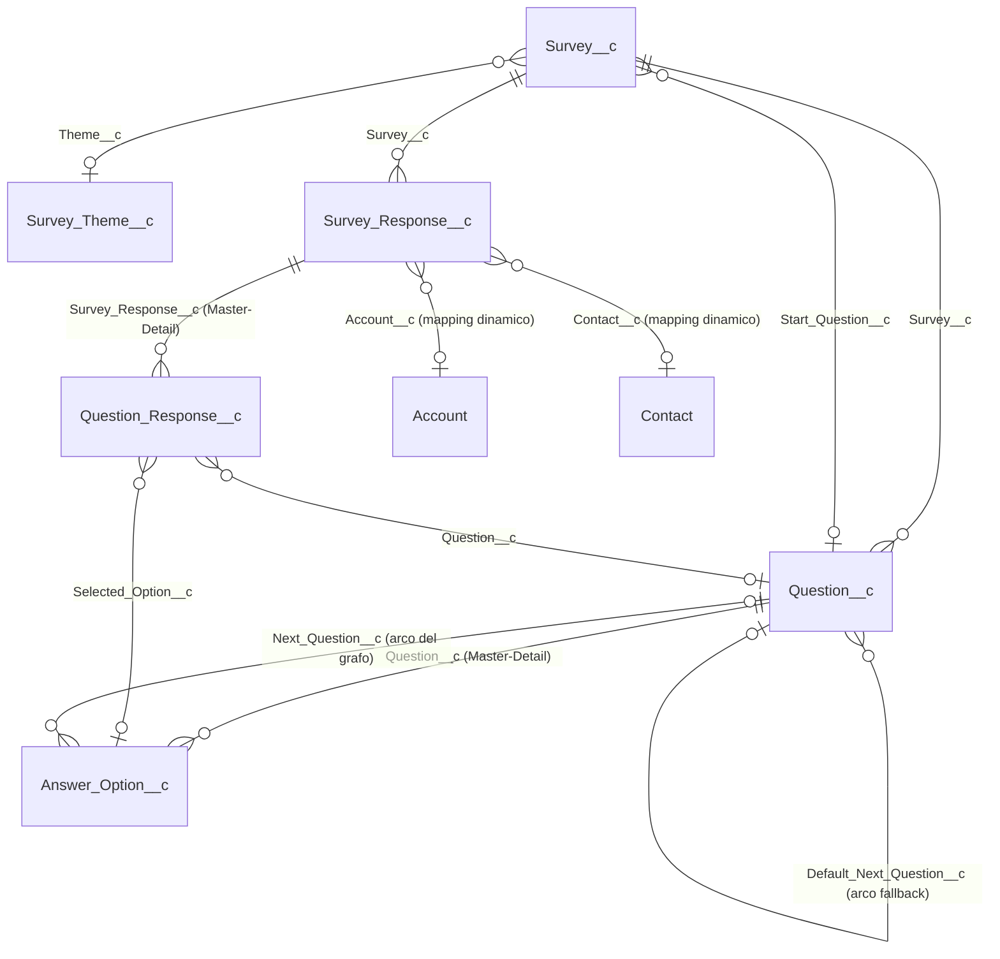

# Survey — Motore di Questionari Condizionali per Salesforce

[🇬🇧 English](README.md) · **🇮🇹 Italiano**

Un motore di **questionari condizionali** per Salesforce, completamente configurabile point-and-click: costruisci questionari a ramificazione come un grafo, personalizzali esteticamente senza scrivere codice, e riusa lo stesso motore di compilazione ovunque — pagine Lightning, screen di un Flow, o componenti LWC scritti da te.

> Progetto Salesforce DX (Apex + LWC, API v66.0), progettato e sviluppato end-to-end con [Claude Code](https://claude.com/claude-code).


## Perché questo progetto

Molte soluzioni "survey" su Salesforce sono form builder generici (lineari, uguali per tutti) oppure richiedono un package AppExchange. Questo è un progetto costruito da zero, a codice aperto, che esplora come si costruisce un **motore di questionari a ramificazione nativo**, usando solo gli strumenti che Salesforce mette a disposizione — nessun servizio esterno, nessun trucco con le static resource, tutto configurabile da un admin senza scrivere codice.

## Caratteristiche principali

- **Modello a grafo condizionale** — ogni domanda è un nodo; le risposte instradano verso la domanda successiva tramite lookup (`Answer_Option__c.Next_Question__c`, con un fallback `Default_Next_Question__c` per le domande a testo libero/scala/data e per le risposte multi-choice divergenti). Le convergenze sono ammesse, i cicli vengono rifiutati da un validatore del grafo (rilevamento cicli e nodi orfani via DFS).
- **Editor visuale del grafo** — canvas drag-and-drop (SVG scritto a mano, nessuna libreria esterna) con auto-layout BFS, posizionamento manuale, evidenziazione di cicli/nodi orfani, e un pannello di inspector per ogni domanda e opzione di risposta.
- **Editor del tema point-and-click con anteprima live** — colori, font, raggio degli angoli, logo (caricato come File Salesforce, ridimensionabile) e toggle della progress bar vivono su un record `Survey_Theme__c` riusabile; un tema può essere condiviso tra più survey. I testi di cornice (titolo, intro, messaggio di chiusura, label dei bottoni) vivono per singolo survey, così lo stesso tema si presenta diversamente su ogni questionario.
- **Collegamento dinamico alle entità** — collega una submission a _qualunque_ record (Account, Contact, o un lookup custom che aggiungi tu) tramite un piccolo mapping JSON, con validazione a runtime di esistenza del campo, tipo e prefisso dell'Id. Aggiungere una nuova entità collegabile è una modifica solo di metadati, zero Apex.
- **Snapshot alla scrittura** — ogni risposta congela testo della domanda, testo della risposta, nome e versione del survey al momento della submission, così lo storico resta coerente anche se il grafo del questionario viene modificato in seguito.
- **Submission atomica a singola DML** — l'intera risposta (sessione + tutte le risposte) viene scritta in un'unica transazione con savepoint/rollback; nessun record parziale o orfano in caso di errore.
- **Funziona ovunque** — lo stesso componente `surveyRunner` funziona su App/Record/Home Page Lightning, dentro uno screen di un Flow (con output `isCompleted`/`surveyResponseId` per ramificare il Flow), o composto direttamente in un altro LWC (genera un evento `surveycompleted`).
- **Export CSV pivotato** — un click esporta tutte le risposte come CSV pronto per un foglio di calcolo (una riga per rispondente, una colonna per domanda), generato lato server come File Salesforce per aggirare le restrizioni di Lightning Web Security sui download client-side. Riservato agli admin.
- **Copertura di test Apex solida** — una suite `SurveyServiceTest` ampia (casi limite dei governor, escaping del CSV, comportamento di tema/logo, percorsi di sicurezza) copre tutta la logica di business.

## Screenshot


_Survey Author: progetta il grafo delle domande visivamente, con validazione di cicli e nodi orfani._


_Survey Experience: theming point-and-click (colori, font, logo, testi) con anteprima istantanea._


_Un click esporta tutte le risposte come foglio di calcolo: una riga per rispondente, una colonna per domanda._

## Architettura a colpo d'occhio

```
LWC surveyRunner (compilazione)     LWC surveyAuthor (editor a grafo)   LWC surveyExperienceEditor (editor tema)
        │                                    │ + lightning/uiRecordApi           │ + lightning/uiRecordApi
        ▼                                    ▼ (CRUD diretto)                    ▼ (CRUD diretto)
SurveyController ───────────────────────────►│                                   │
 (facade @AuraEnabled sottile)               │                                   │
        ▼                                    ▼                                   ▼
SurveyService (business logic, `with sharing`, `WITH SECURITY_ENFORCED`)  ◄── SurveyExportController (solo Admin)
        ▼
Survey__c · Question__c · Answer_Option__c · Survey_Response__c · Question_Response__c · Survey_Theme__c
```

`SurveyController` e `SurveyExportController` sono facade sottili — tutta la logica vive in `SurveyService`. Gli editor scrivono direttamente via `lightning/uiRecordApi`, così CRUD/FLS/sharing sono applicati nativamente. `SurveyExportController` è una classe Apex **separata** (non un metodo su `SurveyController`) proprio per poter concedere l'accesso Apex solo al permission set `Survey_Admin`, senza che trapeli a `Survey_Respondent`.

### Modello dati



Sei oggetti custom, nessun Flow/Process Builder/Workflow Rule, nessuna integrazione esterna — tutto gira dentro Salesforce.

## Per iniziare

Requisiti: [Salesforce CLI](https://developer.salesforce.com/tools/salesforcecli) (`sf`), un'org Salesforce (scratch org, sandbox, o Developer Edition) con accesso API.

```bash
# Autenticati sull'org
sf org login web --alias mySurveyOrg

# Deploy completo (metadati + Apex), eseguendo la suite di test
sf project deploy start --source-dir force-app -l RunSpecifiedTests -t SurveyServiceTest -o mySurveyOrg
```

Poi, nell'org di destinazione:

1. Assegna il permission set `Survey_Admin` a te stesso (e `Survey_Respondent` a chi compilerà i questionari).
2. Apri l'app **Survey Console** → tab **Survey Author** → crea un survey, aggiungi domande e opzioni di risposta, collega il grafo, imposta la domanda di partenza e validalo.
3. Apri la tab **Survey Experience** per assegnare/creare un tema e impostare i testi di cornice.
4. Imposta `Status__c` del survey su `Active`.
5. Inserisci il componente `surveyRunner` su una pagina Lightning (o su uno screen di un Flow, o in un tuo LWC) impostando il `Name` del survey come `surveyName`.

## Documentazione

La documentazione tecnica completa, ancorata al codice sorgente, vive in [`docs/salesforce/`](docs/salesforce/README.md):

| Documento                                                          | Contenuto                                                                       |
| ------------------------------------------------------------------ | ------------------------------------------------------------------------------- |
| [01 — Panoramica](docs/salesforce/01-overview.md)                  | Cos'è, inventario metadati, attori, toolchain                                   |
| [02 — Modello dati](docs/salesforce/02-data-model.md)              | ERD, ogni oggetto/campo, semantica di navigazione del grafo                     |
| [03 — Sicurezza e sharing](docs/salesforce/03-security-sharing.md) | OWD, permission set, sicurezza a livello di codice                              |
| [04 — Automazioni](docs/salesforce/04-automation.md)               | Dove vive la logica di business (nessuna automazione dichiarativa — per scelta) |
| [05 — Apex, LWC e UI](docs/salesforce/05-apex-components.md)       | Ogni classe e componente, in dettaglio                                          |
| [06 — Integrazioni](docs/salesforce/06-integrations.md)            | (Nessuna — completamente self-contained)                                        |
| [07 — Roadmap](docs/salesforce/07-roadmap.md)                      | Miglioramenti decisi/implementati e punti di discussione aperti                 |

## Licenza

[MIT](LICENSE)
