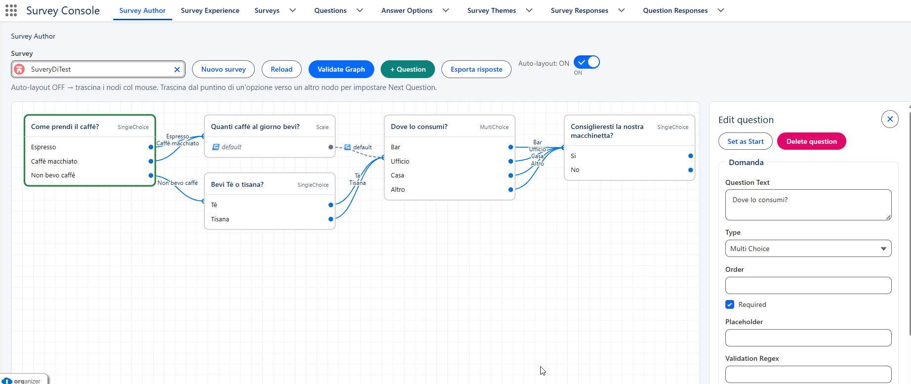
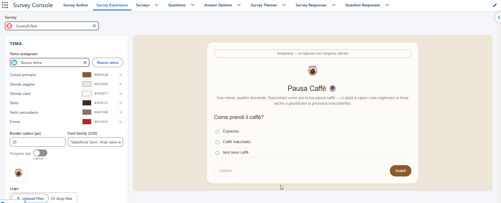
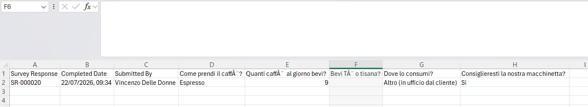
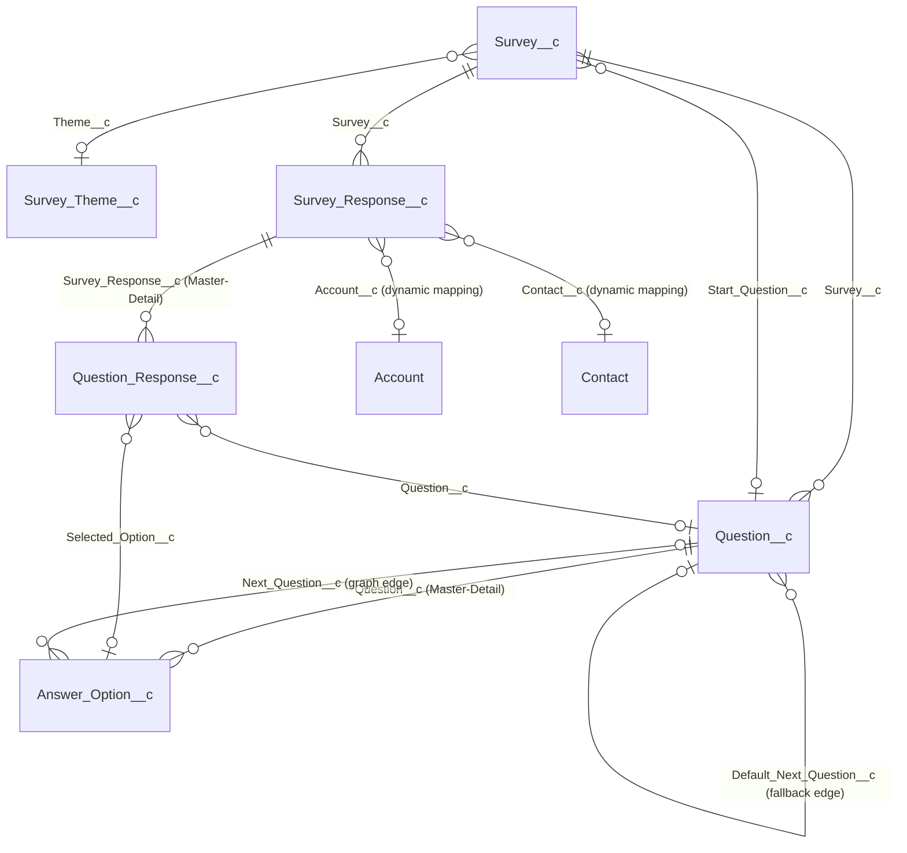

# Survey — Conditional Survey Engine for Salesforce

**🇬🇧 English** · [🇮🇹 Italiano](README.it.md)

A fully declarative, point-and-click **conditional survey engine** for Salesforce: build branching questionnaires as a graph, theme them without touching code, and embed the same compiler anywhere — Lightning pages, Flow screens, or your own Lightning Web Components.

> Built as a Salesforce DX project (Apex + LWC, API v66.0), designed and iterated end-to-end with [Claude Code](https://claude.com/claude-code).

<!-- SCREENSHOT: hero shot — the survey runner mid-compilation, ideally with a custom theme applied, showing progress bar + a branching question. Suggested path: docs/screenshots/survey-runner.png -->


## Why this project

Most "survey" solutions on Salesforce are either a generic form builder (linear, one-size-fits-all) or require an AppExchange package. This is a from-scratch, source-available implementation exploring what a **native, branching survey engine** looks like when built with Salesforce's own building blocks — no external services, no static-resource hacks, everything configurable by an admin without writing code.

## Key features

- **Conditional graph model** — each question is a node; answers route to the next question via lookups (`Answer_Option__c.Next_Question__c`, with a `Default_Next_Question__c` fallback for free-text/scale/date questions and diverging multi-choice answers). Convergence is allowed, cycles are rejected by a graph validator (DFS-based cycle + orphan detection).
- **Visual graph authoring tool** — drag-and-drop canvas (hand-rolled SVG, no external charting library) with BFS auto-layout, manual positioning, cycle/orphan highlighting, and an inspector panel for every question and answer option.
- **Point-and-click theme editor with live preview** — colors, font, corner radius, logo (uploaded as a Salesforce File, resizable), and progress-bar toggle live on a reusable `Survey_Theme__c` record; one theme can be shared across many surveys. Frame texts (title, intro, closing message, button labels) live per-survey, so the same theme reads differently on each questionnaire.
- **Dynamic entity linking** — link a submission to _any_ record (Account, Contact, or a custom lookup you add yourself) via a small JSON mapping, with runtime validation of field existence, type, and Id prefix. Adding a new linkable entity is a metadata-only change, zero Apex.
- **Write-time snapshotting** — every answer freezes the question text, answer text, survey name and version at submission time, so historical responses stay accurate even after the survey graph is edited later.
- **Single-DML atomic submission** — the whole response (session + every answer) is written in one transaction with savepoint/rollback; no partial/orphan records on error.
- **Runs anywhere** — the same `surveyRunner` component works on Lightning App/Record/Home pages, inside a Flow screen (with `isCompleted`/`surveyResponseId` outputs to branch the flow), or composed directly into another LWC (fires a `surveycompleted` event).
- **Pivoted CSV export** — one click exports every response as a spreadsheet-ready CSV (one row per respondent, one column per question), generated server-side as a Salesforce File to sidestep Lightning Web Security's client-side download restrictions. Admin-only.
- **Solid Apex test coverage** — a broad `SurveyServiceTest` suite (governor-limit edge cases, CSV escaping, theme/logo behavior, security paths) backs the business logic.

## Screenshots

<!-- SCREENSHOT: Survey Author — the graph editor canvas with a few branching nodes and an open inspector panel. Suggested path: docs/screenshots/survey-author.png -->


_Survey Author: design the question graph visually, with cycle/orphan validation._

<!-- SCREENSHOT: Survey Experience — the theme/text editor with the live preview panel visible side by side. Suggested path: docs/screenshots/survey-experience.png -->


_Survey Experience: point-and-click theming (colors, font, logo, texts) with an instant live preview._

<!-- SCREENSHOT: the exported CSV opened in a spreadsheet app, or the "Esporta risposte" button. Suggested path: docs/screenshots/export.png -->


_One click exports every response as a spreadsheet: one row per respondent, one column per question._

## Architecture at a glance

```
LWC surveyRunner (fill out)         LWC surveyAuthor (graph editor)   LWC surveyExperienceEditor (theme editor)
        │                                    │ + lightning/uiRecordApi           │ + lightning/uiRecordApi
        ▼                                    ▼ (direct CRUD)                     ▼ (direct CRUD)
SurveyController ───────────────────────────►│                                   │
 (thin @AuraEnabled facade)                  │                                   │
        ▼                                    ▼                                   ▼
SurveyService (business logic, `with sharing`, `WITH SECURITY_ENFORCED`)  ◄── SurveyExportController (Admin-only)
        ▼
Survey__c · Question__c · Answer_Option__c · Survey_Response__c · Question_Response__c · Survey_Theme__c
```

`SurveyController` and `SurveyExportController` are thin facades — all logic lives in `SurveyService`. Editors write directly via `lightning/uiRecordApi` so CRUD/FLS/sharing are enforced natively. `SurveyExportController` is a **separate** Apex class (not a method on `SurveyController`) specifically so its Apex class access can be granted to the `Survey_Admin` permission set only, without leaking to `Survey_Respondent`.

### Data model



Six custom objects, no Flow/Process Builder/Workflow Rule, no external integrations — everything runs inside Salesforce.

## Getting started

Requirements: [Salesforce CLI](https://developer.salesforce.com/tools/salesforcecli) (`sf`), a Salesforce org (scratch org, sandbox, or Developer Edition) with API access.

```bash
# Authenticate to your org
sf org login web --alias mySurveyOrg

# Deploy everything (metadata + Apex), running the test suite
sf project deploy start --source-dir force-app -l RunSpecifiedTests -t SurveyServiceTest -o mySurveyOrg
```

Then, in the target org:

1. Assign the `Survey_Admin` permission set to yourself (and `Survey_Respondent` to whoever will fill out surveys).
2. Open the **Survey Console** app → **Survey Author** tab → create a survey, add questions and answer options, wire up the graph, set a start question, and validate it.
3. Open the **Survey Experience** tab to assign/create a theme and set the frame texts.
4. Set the survey's `Status__c` to `Active`.
5. Drop the `surveyRunner` component on a Lightning page (or a Flow screen, or your own LWC) with the survey's `Name` as `surveyName`.

## Documentation

Full, source-grounded technical documentation lives in [`docs/salesforce/`](docs/salesforce/README.md):

| Doc                                                               | Content                                                           |
| ----------------------------------------------------------------- | ----------------------------------------------------------------- |
| [01 — Overview](docs/salesforce/01-overview.md)                   | What this is, metadata inventory, actors, toolchain               |
| [02 — Data model](docs/salesforce/02-data-model.md)               | ERD, every object/field, graph navigation semantics               |
| [03 — Security & sharing](docs/salesforce/03-security-sharing.md) | OWD, permission sets, code-level security                         |
| [04 — Automation](docs/salesforce/04-automation.md)               | Where business rules live (no declarative automation — by design) |
| [05 — Apex, LWC & UI](docs/salesforce/05-apex-components.md)      | Every class and component, in depth                               |
| [06 — Integrations](docs/salesforce/06-integrations.md)           | (None — fully self-contained)                                     |
| [07 — Roadmap](docs/salesforce/07-roadmap.md)                     | Decided/implemented improvements and open discussion points       |

## License

[MIT](LICENSE)
