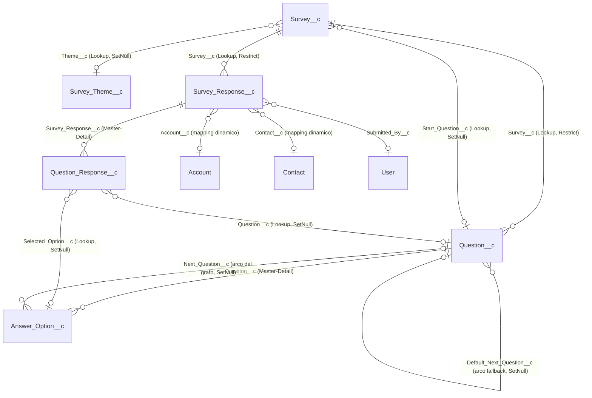

# 02 — Modello dati

> Fonti: `force-app/main/default/objects/**`, descrizioni contenute nei metadati dei campi

## 1. Vista d'insieme

Il modello separa nettamente la **configurazione** del questionario (Survey / Question / Answer Option — il "grafo") dai **dati di risposta** (Survey Response / Question Response — le submission). Il questionario è un **grafo diretto**: i nodi sono le `Question__c`, gli archi vivono su `Answer_Option__c.Next_Question__c` (arco condizionale per opzione) e su `Question__c.Default_Next_Question__c` (arco di fallback); il nodo di partenza è `Survey__c.Start_Question__c`. Convergenze ammesse, cicli vietati (verificati da `SurveyService.validateGraph`, non da vincoli dichiarativi).

### Decisioni di modellazione rilevanti (documentate nei metadati)

- **`Question__c.Survey__c` è Lookup required, non Master-Detail**: la descrizione del campo lo motiva esplicitamente — `Survey__c` a sua volta punta a `Question__c` via `Start_Question__c`, e la dipendenza circolare di schema impedirebbe il deploy di un master-detail. `deleteConstraint = Restrict`: non si può cancellare un Survey che ha ancora domande.
- **`Answer_Option__c.Question__c` è Master-Detail**: le opzioni si cancellano in cascata con la domanda (comportamento sfruttato dall'editor: "Eliminare questa domanda e tutte le sue opzioni?").
- **`Question_Response__c.Survey_Response__c` è Master-Detail**: le risposte si cancellano in cascata con la sessione.
- **Tutti gli archi del grafo sono lookup `SetNull`**: cancellare una domanda non rompe i record che la puntavano (l'arco diventa "ramo terminale").
- **Snapshot alla scrittura**: i 4 campi `*_Snapshot__c` su `Question_Response__c` congelano i testi al momento della submission, così lo storico e il reporting restano coerenti anche se il questionario cambia. Il lookup `Question__c` resta come riferimento "live", ma la descrizione del campo raccomanda di usare gli snapshot per il reporting di lungo periodo.
- **Multi-choice = un record `Question_Response__c` per opzione selezionata** (stessa sessione, stessa domanda), decisione chiusa nel design il 2026-05-21 per semplificare CRM Analytics.

## 2. Survey__c — contenitore del questionario

- **Label**: Survey / Surveys. **Name**: testo, label "Survey Name".
- **Descrizione oggetto**: contenitore di un survey condizionale; regge metadati, nodo di start e riferimento al tema.
- **OWD**: Public Read/Write (interno ed esterno). **History tracking oggetto**: attivo.
- Reports, Search, Streaming API, Bulk API abilitati; Activities, Feeds e Chatter disabilitati.

| Campo                                                 | Tipo                                                           | Obbligatorio  | Note                                                                                                                                                                                                          |
| ----------------------------------------------------- | -------------------------------------------------------------- | ------------- | ------------------------------------------------------------------------------------------------------------------------------------------------------------------------------------------------------------- |
| `Description__c`                                      | Long Text Area (32.768)                                        | No            | Descrizione libera, mostrata agli admin; usata dal runner come testo introduttivo di fallback quando `Intro_Text__c` è vuoto.                                                                                 |
| `Status__c`                                           | Picklist ristretta                                             | Sì            | `Draft` (default) / `Active` / `Archived`. Track history. Solo i survey `Active` sono compilabili (verifica in `SurveyService.loadActiveSurveyByName`). Non esiste automazione dichiarativa sul cambio stato. |
| `Start_Question__c`                                   | Lookup → `Question__c` (SetNull, rel. `Surveys_Starting_Here`) | No (a schema) | Nodo di partenza del grafo. Track history. Obbligatorio _di fatto_ per un survey Active: il runtime lancia eccezione se assente. Vedi nota sotto sulla validation rule.                                       |
| `Theme__c`                                            | Lookup → `Survey_Theme__c` (SetNull, rel. `Surveys`)           | No            | **Tema estetico del survey (R13)**: un tema è riusabile da N survey; vuoto = stile di default del componente. Track history.                                                                                  |
| `Version__c`                                          | Text (50)                                                      | No            | Etichetta di versione informativa, fotografata su ogni `Question_Response__c` alla submission. Track history.                                                                                                 |
| `Display_Title__c`                                    | Text (255)                                                     | No            | Titolo mostrato nell'header del runner (fallback: `Name`). Track history.                                                                                                                                     |
| `Intro_Text__c`                                       | Long Text Area (32.768)                                        | No            | Paragrafo introduttivo del runner (fallback: `Description__c`). Track history.                                                                                                                                |
| `Closing_Message__c`                                  | Long Text Area (32.768)                                        | No            | Messaggio della schermata finale post-submission. Track history.                                                                                                                                              |
| `Next_Label__c` / `Back_Label__c` / `Submit_Label__c` | Text (40)                                                      | No            | Label dei bottoni del runner (fallback: Avanti/Indietro/Invia). Track history.                                                                                                                                |

I sei campi testo sono i **testi di cornice dell'experience** (decisione R13): vivono sul survey — non sul tema — così un tema resta puramente estetico e condivisibile, mentre ogni survey ha le sue parole. Sono configurabili dall'editor `surveyExperienceEditor`.

## 2b. Survey_Theme__c — la configurazione estetica dell'experience (R13)

- **Label**: Survey Theme / Survey Themes. **Name**: testo, label "Theme Name".
- **Descrizione oggetto**: configurazione estetica dell'experience (token colori, font, flag layout, logo come File collegato); referenziato da `Survey__c.Theme__c` per il riuso su più survey; sostituisce i temi JSON da static resource, dismessi il 2026-07-21 (campo `Theme_Static_Resource__c` e resource eliminati da repo e org dopo la migrazione dei dati).
- **OWD**: Public Read/Write interno, **Private esterno** (impostato correttamente fin dalla nascita, senza il residuo segnalato da R7). **History tracking**: attivo.

| Campo                  | Tipo                  | Note                                                                                                                                          |
| ---------------------- | --------------------- | --------------------------------------------------------------------------------------------------------------------------------------------- |
| `Primary_Color__c`     | Text (7)              | Colore accento di bottoni/progress bar (`--survey-primary`).                                                                                  |
| `Background_Color__c`  | Text (7)              | Sfondo pagina (`--survey-bg`).                                                                                                                |
| `Surface_Color__c`     | Text (7)              | Sfondo della card (`--survey-surface`).                                                                                                       |
| `Text_Color__c`        | Text (7)              | Testo principale (`--survey-text`).                                                                                                           |
| `Muted_Color__c`       | Text (7)              | Testo secondario (`--survey-muted`).                                                                                                          |
| `Error_Color__c`       | Text (7)              | Messaggi di errore (`--survey-error`).                                                                                                        |
| `Border_Radius__c`     | Number (3,0)          | Raggio in px di card/input/bottoni (`--survey-radius`); vuoto = default.                                                                      |
| `Font_Family__c`       | Text (255)            | Stack CSS font-family (`--survey-font`); vuoto = default.                                                                                     |
| `Show_Progress_Bar__c` | Checkbox (default on) | Mostra/nasconde la progress bar.                                                                                                              |
| `Logo_Height__c`       | Number (3,0)          | Altezza del logo in px (`--survey-logo-height`); la larghezza si adatta automaticamente per mantenere le proporzioni. Vuoto = default (60px). |

Tutti i 6 campi colore sono presidiati da **validation rule di formato** (`#RRGGBB`, regex `#[0-9A-Fa-f]{6}` — regole `*_Format` sull'oggetto), le prime validation rule del progetto. Tutti i campi hanno track history. Il **logo** non è un campo file: è il File (ContentDocument) più recente collegato al record tema, caricato dall'editor experience e reso visibile ai rispondenti via `registerThemeLogo` (vedi [05-apex-components.md](05-apex-components.md)); `Logo_Height__c` ne controlla solo le dimensioni di rendering, non l'upload.

**Nota su `Start_Question__c`**: la descrizione del campo cita una validation rule ("enforced by validation rule and at runtime") che **oggi non esiste nel repo** — l'unica protezione attuale è l'eccezione a runtime in `SurveyService`. È stato deciso di **inserire la validation rule** (che blocchi `Status__c = Active` senza start question): censita in [07-roadmap.md](07-roadmap.md).

**Nota su `Version__c`**: oggi non esiste automazione né convenzione per l'aggiornamento del campo. È stato deciso di **introdurre un'automazione** che lo gestisca: censita in [07-roadmap.md](07-roadmap.md) (criterio di aggiornamento da definire in quella sede).

## 3. Question__c — il nodo "domanda"

- **Label**: Question / Questions. **Name**: AutoNumber `Q-{00000}`.
- **Descrizione oggetto**: nodo domanda di un grafo Survey; gli archi (next-question) vivono su `Answer_Option__c`.
- **OWD**: Public Read/Write. **History tracking oggetto**: attivo.

| Campo                         | Tipo                                                         | Obbligatorio  | Note                                                                                                                                                                                                  |
| ----------------------------- | ------------------------------------------------------------ | ------------- | ----------------------------------------------------------------------------------------------------------------------------------------------------------------------------------------------------- |
| `Survey__c`                   | Lookup → `Survey__c` (Restrict, rel. `Questions`)            | Sì            | Survey padre. Lookup e non master-detail per la dipendenza circolare con `Start_Question__c` (motivazione nella description del campo). Track history.                                                |
| `Question_Text__c`            | Long Text Area (32.768)                                      | No (a schema) | Testo mostrato al rispondente. Track history.                                                                                                                                                         |
| `Type__c`                     | Picklist ristretta                                           | Sì            | `SingleChoice` (default) / `MultiChoice` / `FreeText` / `Scale` / `Date`. Determina rendering e regola di navigazione (vedi §6). Track history.                                                       |
| `Order__c`                    | Number (5,0)                                                 | No            | Ordinamento di comodo: ordina le domande nell'editor e fa da fallback di visualizzazione.                                                                                                             |
| `Is_Required__c`              | Checkbox                                                     | No            | Se true il rispondente deve rispondere per procedere (validato sia nel LWC sia in Apex alla submission).                                                                                              |
| `Validation_Regex__c`         | Text (255)                                                   | No            | Regex opzionale per le risposte aperte. La description raccomanda di validare la regex stessa in fase di authoring (anti-ReDoS) — **funzionalità oggi non implementata nell'editor**.                 |
| `Validation_Error_Message__c` | Text (255)                                                   | No            | Messaggio di errore configurabile quando la regex non matcha.                                                                                                                                         |
| `Placeholder__c`              | Text (255)                                                   | No            | Placeholder dell'input per domande a testo libero.                                                                                                                                                    |
| `Default_Next_Question__c`    | Lookup → `Question__c` (SetNull, rel. `Default_Routed_From`) | No            | Arco di fallback del grafo: usato quando nessuna `Answer_Option__c` porta il next (FreeText/Scale/Date, o MultiChoice con destinazioni divergenti). Vuoto = nodo terminale. Track history.            |
| `Editor_X__c` / `Editor_Y__c` | Number (8,0)                                                 | No            | Coordinate del nodo nel canvas dell'editor; persistono il layout manuale tra i reload, ignorate con auto-layout attivo. Campi **non previsti dal design originale**, aggiunti a supporto dell'editor. |

## 4. Answer_Option__c — opzione di risposta + arco del grafo

- **Label**: Answer Option / Answer Options. **Name**: AutoNumber `AO-{00000}`.
- **OWD**: Controlled by Parent (master-detail su `Question__c`). **History tracking oggetto**: attivo.

| Campo                        | Tipo                                                      | Obbligatorio | Note                                                                                                                                                                             |
| ---------------------------- | --------------------------------------------------------- | ------------ | -------------------------------------------------------------------------------------------------------------------------------------------------------------------------------- |
| `Question__c`                | **Master-Detail** → `Question__c` (rel. `Answer_Options`) | Sì (MD)      | Domanda di appartenenza; cascade-delete voluto. Track history.                                                                                                                   |
| `Option_Text__c`             | Text (255)                                                | Sì           | Label dell'opzione mostrata al rispondente. Track history.                                                                                                                       |
| `Order__c`                   | Number (5,0)                                              | No           | Ordine di visualizzazione delle opzioni sotto la domanda.                                                                                                                        |
| `Next_Question__c`           | Lookup → `Question__c` (SetNull, rel. `Incoming_Edges`)   | No           | **L'arco del grafo**: la domanda a cui si viene instradati scegliendo questa opzione. Vuoto = ramo terminale (fine questionario, messaggio di chiusura dal tema). Track history. |
| `Allows_Free_Text__c`        | Checkbox                                                  | No           | Abilita l'input di testo libero abbinato all'opzione (pattern "Altro: ___").                                                                                                     |
| `Free_Text_Regex__c`         | Text (255)                                                | No           | Regex applicata al testo libero abbinato, se `Allows_Free_Text__c`.                                                                                                              |
| `Free_Text_Error_Message__c` | Text (255)                                                | No           | Messaggio di errore per la regex del testo libero.                                                                                                                               |

## 5. Survey_Response__c e Question_Response__c — i dati di risposta

### Survey_Response__c — la sessione di compilazione (1 record per submission)

- **Label**: Survey Response / Survey Responses. **Name**: AutoNumber `SR-{000000}`.
- **OWD**: Public Read/Write. **History tracking oggetto**: attivo.

| Campo               | Tipo                                                         | Obbligatorio | Note                                                                                                            |
| ------------------- | ------------------------------------------------------------ | ------------ | --------------------------------------------------------------------------------------------------------------- |
| `Survey__c`         | Lookup → `Survey__c` (Restrict, rel. `Responses`)            | Sì           | Survey compilato. Restrict: non si cancella un Survey con risposte.                                             |
| `Completed_Date__c` | DateTime                                                     | No           | Impostato da Apex (`System.now()`) alla submission.                                                             |
| `Submitted_By__c`   | Lookup → `User` (SetNull, rel. `Survey_Responses_Submitted`) | No           | Utente compilatore, impostato da Apex (`UserInfo.getUserId()`).                                                 |
| `Account__c`        | Lookup → `Account` (SetNull, rel. `Survey_Responses`)        | No           | **Esempio di lookup dinamico**: popolato a runtime quando il JSON di mapping contiene la chiave `"Account__c"`. |
| `Contact__c`        | Lookup → `Contact` (SetNull, rel. `Survey_Responses`)        | No           | Come sopra, per la chiave `"Contact__c"`.                                                                       |

Il meccanismo di **mapping dinamico** (descritto nelle description dei campi e implementato in `SurveyService.applyEntityMapping`) rende questi due lookup solo degli esempi: per collegare una nuova entità (es. `Case__c`) basta creare il campo lookup su `Survey_Response__c` e passare la chiave nel JSON — nessuna modifica al codice. La chiave viene validata a runtime: il campo deve esistere, essere un lookup, e il prefisso dell'Id deve corrispondere all'oggetto target.

Non esiste una lista chiusa di entità da collegare: il meccanismo è **volutamente generico** ("deve poter essere qualunque entità"). Account e Contact sono solo i due esempi versionati; ogni nuova entità si aggiunge creando il lookup su `Survey_Response__c` e aggiornando la FLS nei permission set.

### Question_Response__c — la singola risposta

- **Label**: Question Response / Question Responses. **Name**: AutoNumber `QR-{0000000}`.
- **OWD**: Controlled by Parent (master-detail su `Survey_Response__c`). **History tracking oggetto**: attivo.

| Campo                        | Tipo                                                                 | Obbligatorio | Note                                                                                                                 |
| ---------------------------- | -------------------------------------------------------------------- | ------------ | -------------------------------------------------------------------------------------------------------------------- |
| `Survey_Response__c`         | **Master-Detail** → `Survey_Response__c` (rel. `Question_Responses`) | Sì (MD)      | Sessione padre; cascade-delete voluto.                                                                               |
| `Question__c`                | Lookup → `Question__c` (SetNull, rel. `Answered_In`)                 | No           | Riferimento "live" alla domanda; per il reporting storico usare gli snapshot.                                        |
| `Selected_Option__c`         | Lookup → `Answer_Option__c` (SetNull, rel. `Picked_In`)              | No           | Opzione scelta. Per le MultiChoice: **un record per opzione selezionata**.                                           |
| `Free_Text_Value__c`         | Long Text Area (32.768)                                              | No           | Valore digitato: risposte FreeText/Scale/Date oppure companion "Altro: ___" di un'opzione con `Allows_Free_Text__c`. |
| `Question_Text_Snapshot__c`  | Long Text Area (32.768)                                              | No           | Snapshot di `Question_Text__c` alla submission.                                                                      |
| `Answer_Text_Snapshot__c`    | Long Text Area (32.768)                                              | No           | Snapshot del testo dell'opzione scelta (o del testo libero, per le domande aperte).                                  |
| `Survey_Name_Snapshot__c`    | Text (255)                                                           | No           | Snapshot del nome del Survey.                                                                                        |
| `Survey_Version_Snapshot__c` | Text (50)                                                            | No           | Snapshot di `Survey__c.Version__c`.                                                                                  |

## 6. Semantica di navigazione del grafo (regole runtime)

Regole implementate in `surveyRunner.computeNextQuestionId()` e coerenti con la nota di design del 2026-05-21:

| Tipo domanda                             | Prossima domanda                                                                                                                                       |
| ---------------------------------------- | ------------------------------------------------------------------------------------------------------------------------------------------------------ |
| SingleChoice                             | `Next_Question__c` dell'opzione scelta; se vuoto → `Default_Next_Question__c`; se vuoto → terminale.                                                   |
| MultiChoice                              | Se tutte le opzioni selezionate puntano allo **stesso** next (inclusi i null) → quello; altrimenti → `Default_Next_Question__c`; se vuoto → terminale. |
| FreeText / Scale / Date                  | Sempre `Default_Next_Question__c`; se vuoto → terminale.                                                                                               |
| Nessuna selezione (domanda non required) | `Default_Next_Question__c`; se vuoto → terminale.                                                                                                      |

"Terminale" = fine questionario: il runner esegue la submission e mostra il messaggio di chiusura del tema.

## 7. Osservazioni fattuali (per attenzione futura)

- **Nessuna validation rule, nessun record type, nessun campo formula/rollup** in tutto il modello: l'integrità (start question presente, no cicli, risposta obbligatoria, coerenza dei tipi) è affidata interamente ad Apex e al LWC. Un inserimento via data loader / API aggira tutte queste regole.
- `Question_Response__c.Free_Text_Value__c` è unico per record: nel caso MultiChoice con più opzioni `Allows_Free_Text__c` selezionate, il runner tiene **un solo valore di testo libero per domanda** e Apex lo replica su ogni record di opzione che lo consente (vedi [05-apex-components.md](05-apex-components.md) §3).
- `Question__c.Question_Text__c` e `Option_Text__c` non sono required a schema: l'editor crea domande/opzioni con testi segnaposto ("Nuova domanda", "Nuova opzione"), quindi record vuoti sono tecnicamente possibili.
- Lo storico campi (track history) è attivo su tutti i campi di configurazione "sensibili" (testi, archi, status, versione) — utile per l'audit delle modifiche ai questionari.
